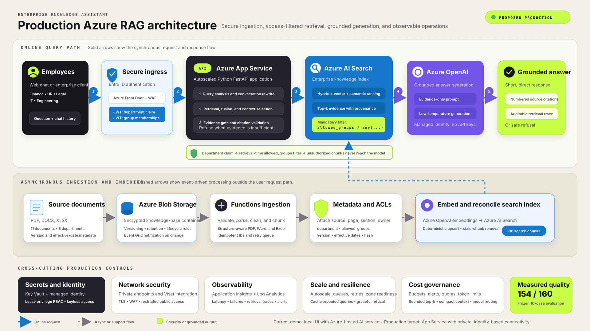

# Production Azure RAG Architecture

## How to present the diagram

1. An employee signs in through Microsoft Entra ID, which supplies department and group claims.
2. Azure App Service hosts the FastAPI application and performs query analysis, retrieval orchestration, evidence checks, and citation validation.
3. Azure AI Search performs hybrid, vector, and semantic retrieval with a mandatory `allowed_groups` filter derived from trusted identity claims.
4. Azure OpenAI receives only authorized evidence and generates a grounded answer.
5. The application validates every citation before returning a numbered, auditable response or a safe insufficient-evidence refusal.
6. Documents enter through Blob Storage and are processed asynchronously into structure-aware chunks with provenance, version, and access metadata.
7. Managed identity, Key Vault, private networking, Application Insights, autoscaling, queues, budgets, and token limits provide production controls.

## Important scope statement

The current working demo runs its web UI and FastAPI application locally while using Azure OpenAI, Azure AI Search, Blob Storage, Application Insights, and Log Analytics in Azure.
Azure App Service, Microsoft Entra application authentication, private endpoints, Key Vault integration, and retrieval-time department filtering are the proposed production deployment target and are not claimed as completed demo infrastructure.
